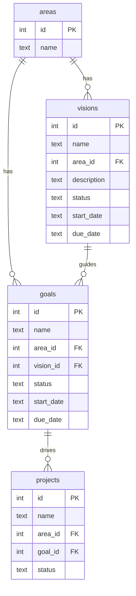

# Design Document: vision-crud

## Overview

Esta feature implementa o CRUD completo do objeto **Vision** (GTD Horizonte 4) no `lowbit-planner`.

Visions são visões de longo prazo (3-5 anos), abstratas, que ficam acima de Goals (H3) na hierarquia GTD e são obrigatoriamente vinculadas a uma Area (H2). O arquivo `libs/objects/vision.sh` existe mas usa convenções antigas (camelCase, tabela `vision` comentada no SQL, sem uso de `generic_*`, `log_print`, `validate_*`). Esta feature refatora completamente esse módulo e adiciona a tabela `visions` ao banco de dados, seguindo os padrões estabelecidos pelos módulos `goal.sh`, `project.sh` e `area.sh`.

A hierarquia de objetos no sistema é:

```
Horizon 5: Principle / Purpose
Horizon 4: Vision      ← esta feature
Horizon 3: Goal
Horizon 2: Area
Horizon 1: Project
Ground:    Task / Inbox
```

Uma Vision pertence obrigatoriamente a uma Area e pode ter Goals vinculadas a ela via `goals.vision_id` (coluna já existente na tabela `goals`).

---

## Architecture

O sistema segue uma arquitetura de shell scripts modular:

```
plan.sh                         ← entry point, despacha para vision_main
  └── libs/objects/vision.sh    ← Vision_Module (refatorado)
        ├── vision_add
        ├── vision_delete
        ├── vision_edit
        ├── vision_list
        ├── vision_search
        ├── vision_start
        ├── vision_stop
        ├── vision_complete
        └── vision_main

libs/database/database_init.sql  ← DDL: tabela visions + view visions_view
libs/objects/generic.sh          ← generic_add, generic_list, generic_set_property
libs/utils/validate.sh           ← validate_database_id, validate_date
libs/utils/log.sh                ← log_print
libs/utils/help.sh               ← help_print_vision, help_print_vision_add
libs/objects/goal.sh             ← goal_add e goal_edit atualizados para --vision por nome
```

O fluxo de uma operação típica:

```
plan vision add "Ser fluente em japonês" --area "Personal" --due-date 2028-12-31
  → plan.sh: vision_main "add" "Ser fluente em japonês" "--area" "Personal" ...
    → vision_add: parse args → resolve area_id → validate_date → generic_add
      → database_run INSERT INTO visions ...
```

---

## Components and Interfaces

### vision_main

Ponto de entrada do módulo. Despacha subcomandos via `case`:

```
vision_main [SUBCOMMAND] [ARGS...]
  add       → vision_add
  complete  → vision_complete
  delete    → vision_delete
  edit      → vision_edit
  list      → vision_list
  search    → vision_search
  start     → vision_start
  stop      → vision_stop
  help / *  → help_get_message vision
```

### vision_add

```
vision_add VISION_NAME --area AREA_NAME [--description DESC] [--start-date YYYY-MM-DD] [--due-date YYYY-MM-DD]
```

- Arg posicional: `VISION_NAME` (obrigatório)
- `--area AREA_NAME` obrigatório: resolve para `area_id` via `SELECT id FROM areas WHERE name = '...'`
- `--description`: opcional, incluído no INSERT se fornecido
- Valida datas via `validate_date`
- Insere via `generic_add "visions" FIELDS VALUES VISION_NAME`

### vision_delete

```
vision_delete VISION_ID
```

- Valida ID via `validate_database_id visions VISION_ID`
- Busca nome para confirmação
- Solicita confirmação via `generic_delete`

### vision_edit

```
vision_edit VISION_ID [--name NEW_NAME] [--area AREA_NAME] [--description DESC] [--start-date DATE] [--due-date DATE]
```

- Valida ID via `validate_database_id`
- Cada flag atualiza via `generic_set_property visions id VISION_ID FIELD VALUE`
- `--area` resolve nome → id antes de atualizar

### vision_list

```
vision_list
```

- Chama `generic_list visions_view "status != 'Done'"`

### vision_search

```
vision_search PATTERN
```

- Executa `SELECT * FROM visions_view WHERE name LIKE '%PATTERN%'`

### vision_start / vision_stop / vision_complete

```
vision_start VISION_ID    → generic_set_status "visions" ID "In Progress"
vision_stop  VISION_ID    → generic_set_status "visions" ID "Pending"
vision_complete VISION_ID → generic_complete "visions" ID
```

Todos validam ID via `validate_database_id`.

### help_print_vision / help_print_vision_add / help_print_vision_edit

Funções adicionadas em `libs/utils/help.sh` seguindo o padrão das demais (`help_print_goal`, `help_print_goal_add`, `help_print_goal_edit`).

### goal_add / goal_edit — atualização para --vision por nome

O flag `--vision` em `goal_add` e `goal_edit` aceita `VISION_NAME`, resolvendo para `vision_id` via `SELECT id FROM visions WHERE name = '...'` — mesmo padrão do `--area`.

---

## Data Models

### Tabela `visions` (nova)

```sql
CREATE TABLE visions (
  id           INTEGER PRIMARY KEY AUTOINCREMENT,
  name         TEXT NOT NULL UNIQUE,
  area_id      INTEGER NOT NULL,
  description  TEXT,
  status       TEXT NOT NULL DEFAULT 'Pending',
  ranking      INTEGER DEFAULT 0,
  start_date   TEXT,
  due_date     TEXT,
  created_at   TEXT NOT NULL DEFAULT CURRENT_TIMESTAMP,
  completed_at TEXT,
  FOREIGN KEY (area_id) REFERENCES areas (id)
);
```

- `area_id`: NOT NULL — Vision sem Area não é permitida (diferença em relação a Goal)
- `description`: nullable — campo adicional para descrever a visão de longo prazo
- `status`: `'Pending'` | `'In Progress'` | `'Done'`

### View `visions_view` (nova)

```sql
CREATE VIEW visions_view AS
SELECT
  visions.id          AS id,
  visions.name        AS name,
  areas.name          AS area,
  visions.description AS description,
  visions.status      AS status,
  visions.start_date  AS start_date,
  visions.due_date    AS due_date,
  visions.ranking     AS ranking
FROM visions
LEFT JOIN areas ON visions.area_id = areas.id;
```

### Tabela `goals` (atualização da view)

A `goals_view` precisa incluir a coluna `vision` (nome da Vision via LEFT JOIN) para exibição:

```sql
CREATE VIEW goals_view AS
SELECT
  goals.id         AS id,
  goals.name       AS name,
  areas.name       AS area,
  visions.name     AS vision,
  goals.status     AS status,
  goals.start_date AS start_date,
  goals.due_date   AS due_date,
  goals.ranking    AS ranking
FROM goals
LEFT JOIN areas   ON goals.area_id   = areas.id
LEFT JOIN visions ON goals.vision_id = visions.id;
```

### Relacionamentos

```
areas   (id) ←── visions.area_id     (NOT NULL)
visions (id) ←── goals.vision_id     (nullable, já existe na tabela goals)
areas   (id) ←── goals.area_id       (nullable)
goals   (id) ←── projects.goal_id    (nullable, já existe)
```

### Diagrama de hierarquia



---

## Correctness Properties

*A property is a characteristic or behavior that should hold true across all valid executions of a system — essentially, a formal statement about what the system should do. Properties serve as the bridge between human-readable specifications and machine-verifiable correctness guarantees.*

### Property 1: Vision add round trip

*For any* valid vision name and existing area name, after inserting via `vision_add`, querying `visions_view` by that name should return exactly one record with the same name, the correct area, and status `'Pending'`.

**Validates: Requirements 2.1, 2.2**

---

### Property 2: Area resolution stores correct area_id

*For any* existing area name passed via `--area` (in `vision_add` or `vision_edit`), the vision's `area_id` in the `visions` table should equal the `id` of that area in the `areas` table.

**Validates: Requirements 2.2, 5.3**

---

### Property 3: Invalid area rejected

*For any* area name that does not exist in the `areas` table, both `vision_add` and `vision_edit --area` should exit with error and the `visions` table should remain unchanged.

**Validates: Requirements 2.4, 5.4**

---

### Property 4: Date validation rejects invalid formats

*For any* string that does not match a valid `YYYY-MM-DD` date, passing it as `--start-date` or `--due-date` to `vision_add` or `vision_edit` should cause the command to exit with error without modifying the database.

**Validates: Requirements 2.6, 2.7, 5.6, 5.7**

---

### Property 5: Vision without area_id rejected by database

*For any* attempt to insert a vision without `area_id`, the database should reject the INSERT due to the NOT NULL constraint, and no record should be created.

**Validates: Requirements 1.3**

---

### Property 6: Status lifecycle transitions

*For any* vision in the database, applying `vision_start` sets status to `'In Progress'`, `vision_stop` sets to `'Pending'`, and `vision_complete` sets to `'Done'` with a non-null `completed_at`.

**Validates: Requirements 6.2, 7.2, 8.2, 8.3**

---

### Property 7: Delete removes vision

*For any* existing vision ID, after `vision_delete` is confirmed, querying `visions` by that ID should return no rows.

**Validates: Requirements 4.3**

---

### Property 8: List excludes completed visions

*For any* set of visions with mixed statuses, `vision_list` should return only visions where `status != 'Done'`, and no completed vision should appear in the output.

**Validates: Requirements 3.3**

---

### Property 9: Search returns only matching visions

*For any* search pattern, all rows returned by `vision_search` should have `name LIKE '%PATTERN%'`, and no row with a non-matching name should appear.

**Validates: Requirements 9.1**

---

### Property 10: Vision name resolution in goal operations

*For any* existing vision name passed via `--vision` to `goal_add` or `goal_edit`, the goal's `vision_id` should be updated to the `id` of that vision in the `visions` table.

**Validates: Requirements 11.1, 11.2**

---

### Property 11: Invalid vision name rejected in goal operations

*For any* vision name that does not exist in the `visions` table, `goal_add --vision` and `goal_edit --vision` should exit with error and the goal's `vision_id` should remain unchanged.

**Validates: Requirements 11.3**

---

## Error Handling

| Situação | Comportamento |
|---|---|
| `VISION_NAME` ausente em `vision add` | `help_get_message vision_add` |
| `--area` ausente em `vision add` | `help_get_message vision_add` |
| `VISION_ID` ausente em delete/edit/start/stop/complete | `help_get_message vision` ou `help_get_message vision_edit` |
| `PATTERN` ausente em `vision search` | `help_get_message vision` |
| Area não encontrada (`--area`) | `log_print error "Area '...' not found"` → exit 1 |
| Vision não encontrada (`goal add/edit --vision`) | `log_print error "Vision '...' not found"` → exit 1 |
| ID inválido (não numérico ou inexistente) | `validate_database_id` → `log_print error` → exit 1 |
| Data em formato inválido | `validate_date` → `log_print error` → exit 1 |
| Falha no INSERT/UPDATE/DELETE | `generic_add`/`generic_set_property` → `log_print error` → exit 1 |

Todos os erros usam `log_print error`, que por design chama `exit 1` automaticamente (ver `libs/utils/log.sh`).

---

## Testing Strategy

### Abordagem dual

O projeto usa `tests/unit-tests.sh` com funções de assert definidas em `libs/utils/test.sh`. A estratégia combina:

- **Testes de exemplo**: verificam comportamentos específicos e casos de borda
- **Testes de propriedade**: verificam invariantes universais com múltiplas entradas geradas

### Testes de exemplo (unit tests)

Focados em:
- Fluxo feliz de cada subcomando (`add`, `delete`, `edit`, `list`, `search`, `start`, `stop`, `complete`)
- Casos de borda: nome vazio, `--area` ausente, ID inexistente, area inexistente, data inválida
- Integração: `goal add --vision VISION_NAME` e `goal edit --vision VISION_NAME` resolvem corretamente
- Estrutura: tabela `visions` e view `visions_view` existem com as colunas corretas
- Estrutura: `goals_view` inclui coluna `vision`

### Testes de propriedade (property-based)

Para shell scripts, property-based testing é implementado via loops com entradas geradas aleatoriamente dentro do próprio `tests/unit-tests.sh`, sem biblioteca externa. Cada propriedade é executada com mínimo de 100 iterações.

Cada teste de propriedade deve incluir um comentário de rastreabilidade:

```bash
# Feature: vision-crud, Property N: <property_text>
```

**Propriedades a implementar como testes:**

| Property | Implementação |
|---|---|
| P1: Vision add round trip | Loop: gerar nomes aleatórios + area existente → inserir → consultar → comparar nome, area e status |
| P2: Area resolution on add/edit | Loop: criar area aleatória → inserir/editar vision → verificar area_id correto |
| P3: Invalid area rejected | Loop: gerar nomes de area inexistentes → tentar inserir/editar → verificar tabela inalterada |
| P4: Date validation | Loop: gerar strings de data inválidas → tentar inserir/editar → verificar sem modificação |
| P5: Vision without area_id rejected | Loop: tentar INSERT direto sem area_id → verificar rejeição pelo banco |
| P6: Status lifecycle | Loop: criar vision → start/stop/complete → verificar status e completed_at |
| P7: Delete removes vision | Loop: inserir → deletar → verificar ausência |
| P8: List excludes completed | Loop: inserir visions com status variados → listar → verificar ausência de 'Done' |
| P9: Search returns matching | Loop: inserir visions com nomes variados → buscar padrão → verificar resultados |
| P10: Vision resolution in goal ops | Loop: criar vision → vincular a goal via add/edit → verificar vision_id correto |
| P11: Invalid vision rejected in goal ops | Loop: nomes de vision inexistentes → tentar vincular → verificar vision_id inalterado |
